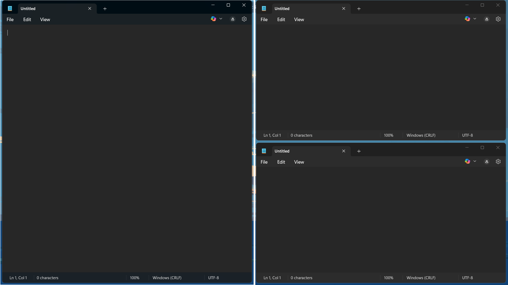
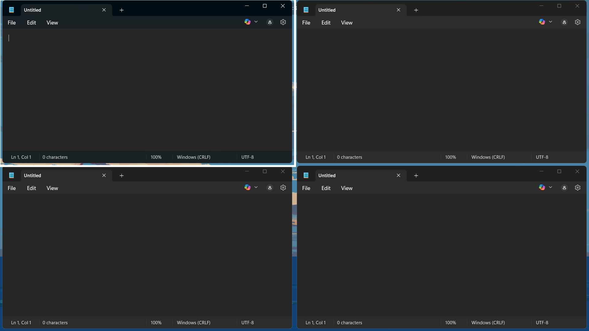

# Tiling Window Manager for Windows (C++)

A lightweight, dynamic tiling window manager for Windows, built entirely in C++ using the Win32 API. Inspired by Linux WMs like dwm and i3, this project brings keyboard-driven window management to the Windows desktop.

## Features

- Four Layouts: MasterStack, Grid, Monocle, EvenSplit (with fallback)
- Drag-and-Drop: Swap windows by dragging one over another
- Focus Highlight: Subtle glow border around focused window
- Auto-Tiling: Windows re-tile when opened, closed, or minimized
- Hotkey Controls:
  - `Alt + J/K` — focus next/previous
  - `Alt + Enter` — promote to master
  - `Alt + L` — cycle layout
  - `Alt + F` — toggle floating
  - `Alt + Q` — exit manager

## Built With

- Language: **C++**
- API: **Win32 API**
- Techniques: Layered windows, global hooks, message loops, system metrics

## Performance

- **<1% idle CPU usage**
- **<500ms layout response** to window changes
- Minimal memory use (2–10MB)

## Screenshot




## License

This project is licensed under the [MIT License](LICENSE).

---

## Getting Started

1. Clone the repo:

   ```bash
   git clone https://github.com/YOUR_USERNAME/tiling-wm-windows.git
   cd tiling-wm-windows
   ```

2. Build the project using MinGW/MSYS2 or Visual Studio:

   - Optionally run `build.bat` if you created one

3. Run the generated `wm.exe`  
   The manager will hide the console, tile your windows, and begin listening for hotkeys.

---
